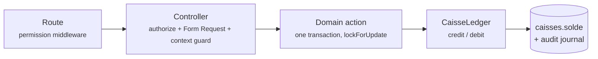

<div align="center">

<br>

# 🎓 GLS CRM

### School-management CRM for **GLS Sprachen Zentrum** — Global Language School

*One PostgreSQL database · 7 centres · real-time cash · a French backoffice that refuses to lose a dirham*

<br>


<br>


<br>

**[Modules](#-modules) · [Money invariants](#️-money-invariants-the-interesting-part) · [Architecture](#️-architecture-at-a-glance) · [Quick start](#-quick-start) · [CLI toolbox](#-cli-toolbox) · [Tests](#-tests)**

</div>

---

## ✨ What is this?

A complete **staff backoffice** for a multi-centre German-language school in Morocco: from the first phone call to the last dirham — student records, enrolments with per-group fee schedules, timetables and attendance, cash collection, teacher payroll, expenses, refunds and a fraud-resistant multi-centre till system — all in a French UI on the PreSkool admin theme.

Built as a **modular monolith**: Laravel 13 + an Inertia.js / React 19 / TypeScript backoffice, business rules isolated in an `app/Domain` layer, and a strict Backoffice / Frontoffice separation (the public student portal is a future phase — today the Frontoffice serves only signed, publicly-readable receipts).

> **Production status:** live on a Hostinger VPS, loaded with the real legacy data of 7 GLS branches — 23 000+ imported payments (≈ 21.8 M DH), students, groups, enrolments and attendance.

---

## 🧩 Modules

### 🎒 Pedagogy & people

| | Module | What it does |
|---|---|---|
| 👨‍🎓 | **Étudiants** | Photo upload, CEFR levels **+ German tracks** (Arbeit / Studium / Ausbildung with conditional Domaine / STK–DSH fields), CIN, guardian block, duplicate **merge** tool, read-only detail page |
| 📝 | **Inscriptions** | Inline new-student creation, fee lines with % or DH discounts in one transaction, per-line **corbeille** (hiding a paid fee releases its money as an advance), group change **across an academic year**, cancellation with a catalogued reason |
| 👥 | **Groupes** | Catalog fees assigned per group (own amount + due date), teacher assignment history, payment **matrix** per group, archive to `groups_historique` — a group is closed, reopened or (super-admin only) deleted, and closing cascades onto its enrolments |
| 🗓️ | **Emploi du temps** | Weekly grid per centre, `creneaux` (recurring slots) with duplicate-slot refusal, closed slots shown greyed rather than hidden, and a **“why is there no séance?”** diagnostic banner |
| ✅ | **Séances & présences** | Day-by-day session generation (08:00 job, bounded by the group's dates), attendance sheet with **payment-arrears badges** on each student's roll-call line, session validation & cancellation |
| 🧑‍🏫 | **Employés** | Login auto-provisioned on creation (one-time credentials + default role by job category), multi-centre assignment with an explicit **primary centre**, photo, 10 job categories |
| 💵 | **Paiement prof** | Teacher payroll: per-employee pay configuration (hourly / GLS / win-win), months anchored on the group, rate ÷ sessions × attendance — read-only calculation feeding a « Paiement prof » expense |

### 💰 Money

| | Module | What it does |
|---|---|---|
| 💳 | **Encaissements** | Fee-line settlement (full / partial), 4 payment methods, **advances** (received but unallocated money) with apply / convert / **split**, payment-method requalification, fee transfer to another student, printable & **WhatsApp-shareable receipt** |
| 🧾 | **Dépenses** | Two forms in one table: ordinary expenses (invoice ref, receipts upload) and « Paiement prof »; optional **approval workflow**, per-centre balance guard, cancellation by compensating entry (never a delete) |
| ↩️ | **Remboursements** | Refunds bounded by the till balance; choosing *which* till is debited is a director-only right; a refund of a rejected-cheque payment reverses the cheque account, not the drawer |
| 🏦 | **Caisses** | *Ma caisse*, unified transactions **journal**, per-centre ventilation on every screen, **two-step till transfers** (validated by the recipient — super-admins do **not** bypass), pending transfers **reserve** their amount, method accounts (TPE / Chèque / Virement) per centre |
| 🧿 | **Chèques** | Bank journey: En possession → Déposé → Encaissé / Rejeté, guarantee-cheque restitution, `cheques.deposit` open to every role (no money moves) while rewriting a cheque stays with management |
| ⏰ | **Recouvrement** | Overdue-fee mirror with duration buckets — it chases **only `Active` enrolments**, so closed files are never billed |
| 📅 | **Échéances en masse** | Applies one due date to many fee lines of a group at once; out-of-scope or hidden lines refuse the **whole batch** |

### 📊 Operations & administration

| | Module | What it does |
|---|---|---|
| 📈 | **Tableau de bord** | Context-aware stat cards + an **annual fees chart** (billed vs collected, filed by month, closed files counted only for what was paid) |
| 📄 | **Rapports** | Catalogued reports (enrolments, students, payments statement, expenses) rendered to **PDF (mPDF)** and streaming **Excel (OpenSpout)**; a new report = one catalogue entry + one Domain query + one Blade view |
| 📦 | **Stock** | Per-centre book & material inventory with in/out movements; the physical stock belongs to the marketing manager alone |
| 📥 | **Import** | Legacy-CRM importer (students, inscriptions, encaissements, présences, or a combined run) with batch/row tracking, per-centre dedupe and a verification pass |
| 🏢 | **Multi-centres** | Top-bar context switcher (academic year + centre) that governs **everything** read *and* written; « Tous les centres » is super-admin only |
| 🔐 | **Rôles & permissions** | **121** `module.action` permissions across **13** roles mirroring the job titles, centre-scoped policies, super-admin safety rails, per-user authorization screen |
| 📜 | **Journal d'audit** | Append-only activity journal (`/9wiwid`) — every model change, plus IP, user-agent, route and a frozen causer label; ids resolved to names at **read** time |
| ⚙️ | **Paramètres** | Centres, academic years (with a no-gap / no-overlap calendar guard), rooms, fee catalog, banks, cancellation reasons, expense & stock types, system switches |
| 🛠️ | **Maintenance** | Maintainer-identity-only tools: a button-driven **database browser/editor** and payment-reconciliation utilities — off the sidebar, but protected by permission, not by absence |

---

## 🛡️ Money invariants (the interesting part)

The finance layer is designed so that **fraud leaves a trail and mistakes cannot be silent**:

<table>
<tr><td width="34%">💸 <b>One transaction</b></td><td>Every money movement runs through a Domain action in a single DB transaction — <code>caisses.solde</code> is application-maintained and never touched by a raw update</td></tr>
<tr><td>🧾 <b>Append-only</b></td><td>Money records are <b>never deleted or re-amounted</b> — corrections are compensating entries; there are no destroy routes to begin with</td></tr>
<tr><td>🤝 <b>Two-person control</b></td><td>Till transfers are request → validation <b>by the recipient</b>; self-validation is refused and <code>Gate::before</code> explicitly excludes it from the super-admin bypass</td></tr>
<tr><td>🔒 <b>Locked reads</b></td><td>Every “read a balance, then write” check runs <i>inside</i> the transaction on a <code>lockForUpdate()</code> row — a guard evaluated before it is a double-spend</td></tr>
<tr><td>🔢 <b>System references</b></td><td><code>ETU-</code> <code>INS-</code> <code>ENC-</code> <code>DEP-</code> <code>RMB-</code> <code>TRF-</code>… are generated, never typed</td></tr>
<tr><td>📜 <b>Full audit</b></td><td>Fraud-relevant models log every column (spatie/activitylog), and the journal model itself throws on update and delete</td></tr>
</table>



### ⚡ Real-time, multi-centre cash — read this before touching money code

> **For AI assistants and new contributors.** This section describes the model the finance code actually implements. Several rules look redundant until you hit the production case that created them. **Do not “simplify” them.**

**The system is real-time across all centres.** There is no batch, no nightly job and no per-centre database: every payment, expense, refund and transfer is written and visible **immediately, in every centre**, through one PostgreSQL database. A cashier in Rabat and a director in Marrakech reading the same screen at the same moment see the same figures.

- **Never cache a balance, never recompute one “later”.** No queue, no scheduled reconciliation, no eventual consistency.
- **The balance moves ONLY through `Domain\Finance\Support\CaisseLedger`** (`credit()` / `debit()`). Never `increment('solde')`, `decrement()` or a raw update: those fire no events and leave the movement **invisible to the audit journal** — the exact fraud hole the ledger replaced.

#### One employee = one till, for life — but they collect for many centres

An employee keeps **exactly one** « Caissière » till forever (a DB constraint enforces it). They may nevertheless work in several centres, so:

- Every ledger entry stamps `etablissement_id`, so one till **breaks down per centre** from the journal alone.
- Per-centre figures are always **derived**, never stored, and always through the single source `Domain\Finance\Support\VentilationCentre`.
- **A total must be computed on the same columns as the rows it sits above.** A ventilated balance over unventilated rows means one screen contradicts another, and the user can no longer tell which to believe.
- **A transfer changes TILL, never CENTRE**: both legs are booked to the centre the money *leaves*.
- **A pending transfer reserves its amount**: expenses, refunds and further requests are all checked against `solde − réservé`, and the refusal names the reserving `TRF-…`.
- **An expense belongs to the centre where it was keyed**, not to the centre of the till it debits — and the balance it is checked against is that centre's share, super-admin included.

#### Which account receives the money

Decided **only** by `Domain\Finance\Support\CaisseResolver` — never re-derived in a controller or a screen:

| Operation | Account debited / credited |
|---|---|
| Payment, **Espèces** | the cashier's own physical till |
| Payment, **TPE / Chèque / Virement** | the **active centre's** account for that method (the physical till never moves) |
| **Expense, refund** | **always** the acting employee's physical till, whatever the method says |
| **Transfer** | cash accounts only — a method account is refused |

`caisse_id` is stored on the row and **immutable**, so cancelling, approving or applying an advance reverses or follows the *same* account with no guessing. Changing `encaissements.methode` is therefore a **money movement**, not a label edit: it debits the old account and credits the new one, both legs journaled.

#### Advances (`avances`) — where most of the subtlety lives

An **avance** is money received but not yet allocated to a fee (`inscription_fee_id IS NULL`). Applying it to a fee creates a **second row** (`applied_from_encaissement_id` → the avance); the avance row itself is never edited, and **no till moves** — the money already arrived, only its allocation changes.

- **An application row inherits `caisse_id`, `agent_id`, `date_paiement` and `methode` from the avance** — never from the employee clicking, never from today. Stamping today would rewrite when GLS was paid.
- **Application rows are excluded from every “money received” total** (journal, cash accounts, reports). Counting them double-counts the same dirham — measured at 2.3 M DH on the real database.
- **A payment can be SPLIT when converting to an avance** (« À libérer »): part stays on the original fee, the rest becomes an avance. This is *composed* from the two existing primitives — detach, then re-apply the kept part — so no amount is edited and no new money row is created. Typical case: a student studies two weeks in group A, moves to group B; 700 DH stays on A, 700 DH follows them to B.
- **The chain can be several levels deep** (applied → reconverted → re-applied). Always read it through `ResoudreAllocationsAvance`, never one hop.
- **The cheque behind an avance is read through the chain** (`Domain\Payments\Support\ChequeOrigine`) — an application row carries no `cheque_id` of its own, so testing `$row->cheque_id` directly misses a rejected cheque and lets non-existent money be applied or refunded from the till.
- **Receiving and allocating are not the same gesture**: a *payment* requires an `Active` enrolment (new money must never reopen a closed debt), while *applying an advance* is allowed on any status — the money is already in the till and only its allocation is being decided.

### 🎯 The rule behind the rules

> **Two screens must never show two different truths about the same dirham.**
> When a number looks wrong, fix the single shared definition — don't add a second calculation next to it. And when a read-model needs to know whether an action will be accepted, it must **carry that action's own rule** (`applicable`, `splittable`, `methodeRequalifiable`, `transferableAutreEtudiant`…) rather than re-deriving one, or the screen will offer what the server refuses. Options the server would reject are **shown and disabled with the reason**, never hidden.

---

## 🏗️ Architecture at a glance

```
routes/backoffice.php ── auth + permission middleware
   └─ Thin controller  ── authorize() + Form Request + AssertsContextScope
         └─ app/Domain/<Module>/Actions ── the real business rules, one transaction
         └─ Inertia::render('Backoffice/<Module>/Index', [...typed props])
               └─ resources/js/Pages/Backoffice/<Module>/Index.tsx (React 19 + TS)
                     └─ Layouts/BackofficeLayout.tsx  (PreSkool theme, Bootstrap 5)
                     └─ Components/{Tables,Forms,Modals}/…  (shared building blocks)
```

| Layer | Rule |
|---|---|
| **Frontend** | Inertia + React on **every** backoffice screen — no Livewire, no Alpine, no jQuery plugin anywhere (fully removed, Phase 11) |
| **Lists** | Server-side pagination / search / sort / filter, always — never a client-side dataset; PostgreSQL `ILIKE` for every user-facing search |
| **Dropdowns** | Native `<select>` via `Components/Forms/SelectField.tsx` — no Select2, no jQuery bridge |
| **Modals** | React state only (`Components/Modals/Modal.tsx`) — the Bootstrap markup is reused, its JavaScript is not |
| **Filters** | Never reset as a side effect; cleared only by the explicit « Réinitialiser les filtres » button, and mutations redirect **preserving the query string** |
| **Authorization** | Server-side: `permission:` middleware + policies. Props like `CrudPermissions` only hide affordances |
| **Centre reach** | « Centres affectés » on the employee form is the *only* authority — never a role, never a permission |
| **Context** | The top-bar year + centre switcher governs every read **and** every write (`AssertsContextScope`) |
| **i18n** | French first: every visible string goes through `__()` / `t()` against the same `lang/fr.json` dictionary on both sides |
| **Uploads** | spatie/medialibrary on a dedicated disk, served from `/media/<uuid8>/…` |
| **Database** | PostgreSQL only — no SQLite, no MySQL, no driver branches; `jsonb` over `json`; explicit indexes on FK columns |

📚 Deep dives live in [`docs/`](docs/) — architecture, [roles & permissions](docs/roles-and-permissions.md), [audit journal](docs/audit-journal.md), [VPS deployment](docs/vps-deployment.md), [legacy import CLI](docs/legacy-import-cli.md) — dated audits and measurements in [`docs/rapports/`](docs/rapports/), and the full DB rationale in [`gls-crm-schema.md`](gls-crm-schema.md). **[`CLAUDE.md`](CLAUDE.md) is the binding rule set for any contributor, human or AI.**

---

## 🚀 Quick start

### Requirements

```text
PHP 8.4        (extensions: pdo_pgsql, pgsql, exif)
PostgreSQL 16+ (17 used in development and production)
Composer 2
Node.js 20+ and npm
```

```powershell
# Windows — this project pins PHP 8.4 explicitly
C:\php84\php.exe -m | findstr /I "pgsql pdo_pgsql exif"
```

```bash
# Linux / macOS
php -m | grep -E 'pgsql|pdo_pgsql|exif'
```

### Local database

PostgreSQL is the **only** supported engine. Create a dedicated application role rather than using the `postgres` superuser:

```sql
CREATE ROLE gls_crm_app WITH LOGIN PASSWORD '<strong-local-password>';
CREATE DATABASE gls_crm OWNER gls_crm_app;

-- separate database for the test suite — never point tests at gls_crm
CREATE ROLE gls_crm_test_app WITH LOGIN PASSWORD '<strong-test-password>';
CREATE DATABASE gls_crm_test OWNER gls_crm_test_app;
```

### Setup

```bash
git clone https://github.com/Rochdi7/CRM-GLS.git && cd CRM-GLS
composer install && npm install
cp .env.example .env               # set DB_USERNAME / DB_PASSWORD to gls_crm_app
php artisan key:generate
php artisan migrate --seed         # reference data + real staff only — idempotent
php artisan storage:link
npm run build
php artisan test
php artisan serve                  # http://127.0.0.1:8000 → backoffice login
npm run dev                        # Vite watch (our JS/TS only)
```

<details>
<summary><b>Windows / PHP 8.4 equivalents</b> (several PHP versions coexist on the dev machine)</summary>

```powershell
Set-Location "C:\Users\ASUS\Desktop\Projects\crm gls"
C:\php84\php.exe C:\composer\composer.phar install
C:\php84\php.exe artisan migrate --seed
C:\php84\php.exe artisan test
C:\php84\php.exe artisan serve
```
</details>

### 🌱 What `db:seed` actually creates

> **There is no demo/fake-data seeder, and none may be added.** `db:seed` is
> **production-safe and idempotent** — it seeds only reference data and the real
> GLS staff, so it can be re-run on a live database.

| Seeder | Creates |
|---|---|
| `RolesAndPermissionsSeeder` | the 121 permissions and 13 role presets |
| `ReferentialDataSeeder` | 7 GLS branches, rooms, academic years |
| `AdminUserSeeder` | the super-admin account (password written **only on creation**) |
| `TypeDepense` · `StockType` · `BookStock` · `Frais` · `Banque` · `MotifAnnulation` | the locked catalogs (books at quantity **0** — real stock enters by a movement) |
| `GlsStaffSeeder` | the real `@glszentrum.com` staff, keyed on e-mail |

It creates **no student, group, enrolment, stock quantity or money record** — those come from the Import screen or from the app itself. A seeder garnishes a catalog; it never reopens what an admin closed and never takes a password back.

Local login defaults to `ADMIN_EMAIL` / `ADMIN_PASSWORD` (`rafik@glszentrum.com` / `password`). On any non-local environment **`ADMIN_PASSWORD` must be set or the seeder refuses to run**, and the account is created with `must_change_password`.

---

## 🧰 CLI toolbox

Roughly 40 purpose-built commands live in `app/Console/Commands`. The ones you actually reach for:

| Command | Does |
|---|---|
| `import:centre` | Full legacy-CRM import for one centre (students, inscriptions, payments) |
| `import:presences` | Legacy attendance import, centre-scoped |
| `import:verifier` | Read-only verification of an import against the source export |
| `caisse:verifier-coherence` | **Read-only auditor**: mis-routed rows, duplicate accounts, tills per employee, balance vs journaled movements (`--strict`) |
| `caisse:recalculer-soldes` | Re-homes historical non-cash *payments* left in a till (dry-run by default, `--apply`) |
| `depenses:annuler-doublon` | Cancels a duplicated expense by compensating entry — refuses unless every proof matches |
| `groupes:supprimer-creneaux-doubles` | Removes duplicate timetable slots, keeping the oldest (dry-run by default) |
| `inscriptions:liberer-paiements-frais-masques` | Releases money stuck on fee lines hidden before the fix |
| `auth:assign-super-admin` | First super-admin assignment |
| `auth:sync-default-roles` | Idempotent repair of role-less logins after a restore |
| `seances:generer` | The 08:00 day-by-day session generator |

> 🚨 Every destructive command **dry-runs by default** and needs `--apply`. Read the dry-run output before touching production, and run `caisse:verifier-coherence` before *and* after anything that moves money.

---

## 🧪 Tests

```bash
php artisan test          # 168 test files, ~1 685 cases
```

Feature tests cover every module: allowed **and** denied (403) paths, centre scoping, context write guards, money invariants (balances move exactly once, self-validation refused, no expense beyond its centre's share), advance chains, Inertia page/modal flows, seeder idempotence and upload rules.

Tests run against a real PostgreSQL database, `gls_crm_test` (`phpunit.xml`), kept separate from the dev database `gls_crm`. **Never point PHPUnit at `gls_crm`** — `RefreshDatabase` and any destructive seeder must only ever run against `gls_crm_test`.

### ✅ Before declaring any work complete

```bash
php artisan test          # green
npm run build             # no missing imports
npx tsc --noEmit          # no TypeScript errors
php artisan route:list     # routes named correctly
```

…then open the affected page: theme assets resolve, no console errors, and `git status` shows **no change under `theme-reference/`**.

---

## 🔐 Security & authorization highlights

- **13 roles, one per job title** — permissions are checked, role names never are (only three deliberate `hasRole()` sites exist).
- **Only super-admins delete.** `PermissionRegistry::superAdminOnly()` *filters* every preset, so writing a `*.delete` into one has no effect — and a future `*.delete` is locked down automatically.
- **Some abilities exclude even the super-admin bypass** (`NO_SUPER_ADMIN_BYPASS`): validating a transfer into someone else's till, cancelling an expense, editing a closed group. Two-person control must survive the most privileged account.
- **Two maintenance tools are gated by identity, not permission** — the database browser and closed-group correction answer to a single maintainer account, decided *above* `Gate::before`.
- **The maintainer accounts are hidden from every list, dropdown and total — never from recording.** Hiding is a display filter; the journal writes their entries in full, with a toggle to show them again.
- **The audit journal is append-only at the model level**, below every gate, and its only route is `index`/`show`.
- `migrate:fresh` / `migrate:refresh` / `db:wipe` are **refused in production** by `DB::prohibitDestructiveCommands()`, and `deploy.sh` snapshots the database before every deploy.

---

<div align="center">

<br>

**GLS Sprachen Zentrum** · Backoffice CRM

*Made with ❤️, PostgreSQL, and a healthy fear of untracked cash*

</div>
