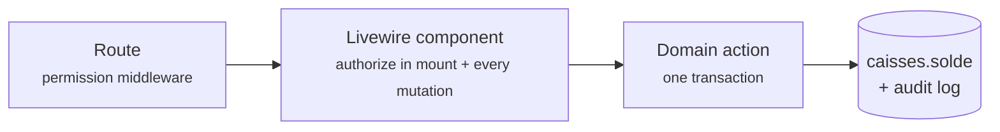

<div align="center">

# 🎓 GLS CRM

### School-management CRM for **GLS Sprachen Zentrum** — Global Language School

*Centers · Students · Enrollments · Groups & Fees · Payments · Expenses · Till Management · Roles & Permissions*

<br>


</div>

---

## ✨ What is this?

A complete **staff backoffice** for a multi-center German-language school in Morocco: from the first phone call to the last dirham — student records, enrollments with per-group fee schedules, cash collection, expense tracking and a fraud-resistant till system — all in a French UI on the PreSkool admin theme.

Built as a **modular monolith**: Laravel 13 + Livewire 4 server-driven screens, business rules isolated in a Domain layer, and a strict Backoffice / Frontoffice separation (the public student portal is a future phase).

## 🧩 Modules

| | Module | Highlights |
|---|---|---|
| 👨‍🎓 | **Étudiants** | Photo upload, CEFR levels **+ German tracks** (Arbeit / Studium / Ausbildung with conditional Domaine / STK–DSH fields), CIN, parent/guardian block |
| 📝 | **Inscriptions** | Inline new-student creation, fee lines with % or DH discounts in one transaction, scoped to the active academic year |
| 👥 | **Groupes** | Catalog fees assigned per group (own amount + due date), archived — **never deleted** — with a history snapshot |
| 🧑‍🏫 | **Employés** | Login auto-provisioned on creation (one-time credentials), photo & address, 10 job categories |
| 💰 | **Paiements** | Fee-line settlement (full / partial), 4 payment methods, cheque details, printable receipt |
| 🧾 | **Gestion des dépenses** | Tabbed page: expenses (invoice ref, payment method, group link, live till balance) + refunds + expense types |
| 🏦 | **Gestion de la caisse** | Tabbed page: *Ma caisse*, unified transactions journal, **two-step till transfers** (requester ≠ validator), till accounts |
| 🔐 | **Rôles & permissions** | 65 `module.action` permissions, 6 seeded roles, center-scoped data access, super-admin safety rails |
| 🏢 | **Multi-centres** | Top-bar context switcher (academic year + center) — every screen follows it live |
| ⚙️ | **Paramètres** | Centers, academic years, rooms and the fee catalog in one tabbed page |

## 🛡️ Money invariants (the interesting part)

The finance layer is designed so that **fraud leaves a trail and mistakes can't be silent**:

- 💸 Every money movement runs through a **Domain action in one DB transaction** — `caisses.solde` is application-maintained, never touched by raw updates
- 🚫 Money records are **never deleted or re-amounted** — corrections are compensating entries; there are no destroy routes to begin with
- 🤝 Till transfers are **two-step**: request (balances untouched) → validation by a *different* employee, with before/after balance snapshots
- 🔢 All references (`ETU-`, `INS-`, `ENC-`, `DEP-`, `TRF-`…) are **system-generated**, never typed
- 📜 Fraud-relevant models carry a **full audit log** (spatie/activitylog)



## 🚀 Quick start

```bash
git clone https://github.com/Rochdi7/CRM-GLS.git && cd CRM-GLS
composer install && npm install
cp .env.example .env
php artisan key:generate
php artisan migrate --seed        # full demo dataset, idempotent
php artisan storage:link
php artisan serve                 # http://127.0.0.1:8000 → backoffice login
npm run dev                       # Vite watch (our JS/SCSS only)
```

> SQLite out of the box for local dev; point `.env` at MySQL for production.

### 🔑 Demo accounts (local only — password: `password`)

| Login | Role | Sees |
|---|---|---|
| `admin@gls.test` | Super-admin | everything, bypasses all gates |
| `directeur@gls.test` | Directeur | all centers, validates transfers |
| `operations@gls.test` | Dir. des opérations | all centers, finance read-only |
| `assistante@gls.test` | Assistante admin. | **one center**, records money, can't validate |
| `enseignant@gls.test` | Enseignant | groups & students only |
| `marketing@gls.test` | Resp. marketing | read-only funnel data |

The seeders also create 7 GLS branches with rooms, a fee catalog, students, groups, enrollments and real finance movements — every screen has data to click through.

## 🏗️ Architecture at a glance

```
routes/backoffice.php ── auth + permission middleware
   └─ Livewire full-page component (list + modal CRUD)   ← most screens
      or thin controller (detail pages, tabbed hosts)
         └─ <x-backoffice.layout.app> Blade shell (PreSkool theme)
            └─ app/Domain/<Module>/Actions ── the real business rules
```

- **Livewire only where server dynamics are needed** — static UI is plain Blade, client-only state is Alpine (bundled with Livewire, never installed twice)
- **Select2 on every CRUD dropdown**, bridged to Livewire through a `wire:ignore` island + Alpine `@entangle`
- **Center scoping is authorization**: policies combine the permission with `CenterAccessService`
- **French first**: every visible string goes through `__()` with translations in `lang/fr.json`
- **Uploads** via spatie/medialibrary on a dedicated disk, served from `/media/<uuid8>/…`

📚 Deep dives live in [`docs/`](docs/): [backoffice architecture](docs/backoffice-architecture.md) · [roles & permissions](docs/roles-and-permissions.md) · [center scoping](docs/center-scoping.md) — plus the full DB schema rationale in [`gls-crm-schema.md`](gls-crm-schema.md).

## 🧪 Tests

```bash
php artisan test        # 289 tests, 1006 assertions
```

Feature tests cover every module: allowed **and** denied (403) paths, center scoping, money invariants (balances move exactly once, self-validation refused), Livewire modal flows and upload rules.

---

<div align="center">

**GLS Sprachen Zentrum** · Backoffice CRM · Made with ❤️ and a healthy fear of untracked cash

</div>
