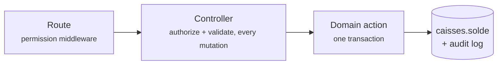

<div align="center">

# 🎓 GLS CRM

### School-management CRM for **GLS Sprachen Zentrum** — Global Language School

*Centers · Students · Enrollments · Groups & Fees · Payments · Expenses · Till Management · Roles & Permissions*

<br>


</div>

---

## ✨ What is this?

A complete **staff backoffice** for a multi-center German-language school in Morocco: from the first phone call to the last dirham — student records, enrollments with per-group fee schedules, cash collection, expense tracking and a fraud-resistant till system — all in a French UI on the PreSkool admin theme.

Built as a **modular monolith**: Laravel 13 API + an Inertia.js/React/TypeScript backoffice, business rules isolated in a Domain layer, and a strict Backoffice / Frontoffice separation (the public student portal is a future phase).

## 🧩 Modules

| | Module | Highlights |
|---|---|---|
| 👨‍🎓 | **Étudiants** | Photo upload, CEFR levels **+ German tracks** (Arbeit / Studium / Ausbildung with conditional Domaine / STK–DSH fields), CIN, parent/guardian block |
| 📝 | **Inscriptions** | Inline new-student creation, fee lines with % or DH discounts in one transaction, scoped to the active academic year |
| 👥 | **Groupes** | Catalog fees assigned per group (own amount + due date), archived — **never deleted** — with a history snapshot |
| 🧑‍🏫 | **Employés** | Login auto-provisioned on creation (one-time credentials), photo & address, 10 job categories |
| 💰 | **Paiements** | Fee-line settlement (full / partial), 4 payment methods, cheque details, printable receipt |
| 🧾 | **Gestion des dépenses** | Tabbed page: expenses (invoice ref, payment method, group link, live till balance) + refunds + expense types |
| 🏦 | **Gestion de la caisse** | Tabbed page: *Ma caisse*, unified transactions journal, **two-step till transfers** (requester ≠ validator), till accounts |
| 🔐 | **Rôles & permissions** | 65 `module.action` permissions, 6 seeded roles, center-scoped data access, super-admin safety rails |
| 🏢 | **Multi-centres** | Top-bar context switcher (academic year + center) — every screen follows it live |
| ⚙️ | **Paramètres** | Centers, academic years, rooms and the fee catalog in one tabbed page |

## 🛡️ Money invariants (the interesting part)

The finance layer is designed so that **fraud leaves a trail and mistakes can't be silent**:

- 💸 Every money movement runs through a **Domain action in one DB transaction** — `caisses.solde` is application-maintained, never touched by raw updates
- 🚫 Money records are **never deleted or re-amounted** — corrections are compensating entries; there are no destroy routes to begin with
- 🤝 Till transfers are **two-step**: request (balances untouched) → validation by a *different* employee, with before/after balance snapshots
- 🔢 All references (`ETU-`, `INS-`, `ENC-`, `DEP-`, `TRF-`…) are **system-generated**, never typed
- 📜 Fraud-relevant models carry a **full audit log** (spatie/activitylog)



## ⚡ Real-time, multi-centre cash — read this before touching money code

> **For AI assistants and new contributors.** This section describes the model
> the finance code actually implements. Several rules look redundant until you
> hit the production case that created them. **Do not "simplify" them.**

**The system is real-time across all centres.** There is no batch, no nightly
job and no per-centre database: every payment, expense, refund and transfer
is written and visible **immediately, in every centre**, through one PostgreSQL
database. A cashier in Rabat and a director in Marrakech reading the same
screen at the same moment see the same figures. Consequences you must respect:

- **Never cache a balance, never recompute one "later".** `caisses.solde` is
  the authoritative total and it is application-maintained inside the same
  transaction as the record that moved it. No queue, no scheduled
  reconciliation, no eventual consistency.
- **Every "read a balance, then write" check runs INSIDE the transaction on a
  `lockForUpdate()` row.** Two cashiers in two centres can act on the same
  till in the same second; a guard evaluated before `DB::transaction` is a
  double-spend, not a guard.
- **The balance moves ONLY through `Domain\Finance\Support\CaisseLedger`**
  (`credit()` / `debit()`). Never `increment('solde')`, `decrement()` or a raw
  update: those fire no events and leave the movement **invisible to the audit
  journal** — the exact fraud hole the ledger replaced.

### One employee = one till, for life — but they collect for many centres

An employee keeps **exactly one** « Caissière » till forever (a DB constraint
enforces it). They may nevertheless work in several centres, so:

- Every ledger entry stamps `etablissement_id`, so one till **breaks down per
  centre** from the journal alone.
- Per-centre figures are always **derived**, never stored, and always through
  the single source `Domain\Finance\Support\VentilationCentre`.
- **A total must be computed on the same columns as the rows it sits above.**
  A ventilated balance over unventilated rows means one screen contradicts
  another, and the user can no longer tell which to believe.
- **A transfer changes TILL, never CENTRE**: both legs are booked to the
  centre the money *leaves*.

### Which account receives the money

Decided **only** by `Domain\Finance\Support\CaisseResolver` — never re-derived
in a controller or a screen:

| Operation | Account debited / credited |
|---|---|
| Payment, Espèces | the cashier's own physical till |
| Payment, TPE / Chèque / Virement | the **active centre's** account for that method (the physical till never moves) |
| Expense, refund | **always** the acting employee's physical till, whatever the method says |
| Transfer | cash accounts only |

`caisse_id` is stored on the row and **immutable**, so cancelling, approving or
applying an advance reverses or follows the *same* account with no guessing.

### Advances (`avances`) — where most of the subtlety lives

An **avance** is money received but not yet allocated to a fee
(`inscription_fee_id IS NULL`). Applying it to a fee creates a **second row**
(`applied_from_encaissement_id` → the avance); the avance row itself is never
edited, and **no till moves** — the money already arrived, only its allocation
changes.

- **An application row inherits `caisse_id`, `agent_id`, `date_paiement` and
  `methode` from the avance** — never from the employee clicking, never from
  today. Stamping today would rewrite when GLS was paid.
- **Application rows are excluded from every "money received" total** (journal,
  cash accounts, reports). Counting them double-counts the same dirham.
- **A payment can be SPLIT when converting to an avance** (« À libérer »): part
  stays on the original fee, the rest becomes an avance. This is *composed*
  from the two existing primitives — detach, then re-apply the kept part — so
  no amount is edited and no new money row is created. Typical case: a student
  studies two weeks in group A, moves to group B; 700 DH stays on A, 700 DH
  follows them to B.
- **The chain can be several levels deep** (applied → reconverted → re-applied).
  Always read it through `ResoudreAllocationsAvance`, never one hop.
- **The cheque behind an avance is read through the chain**
  (`Domain\Payments\Support\ChequeOrigine`) — an application row carries no
  `cheque_id` of its own, so testing `$row->cheque_id` directly misses a
  rejected cheque and lets non-existent money be applied or refunded from the
  till.

### The rule behind the rules

**Two screens must never show two different truths about the same dirham.**
When a number looks wrong, fix the single shared definition — don't add a
second calculation next to it. And when a read-model needs to know whether an
action will be accepted, it must **carry that action's own rule**
(`applicable`, `splittable`, `methodeRequalifiable`…) rather than re-deriving
one, or the screen will offer what the server refuses.

## 🚀 Quick start

### Requirements

```text
PHP 8.4+
PostgreSQL 16+ (17 used in development)
Composer
Node.js and npm
```

**Required PHP extensions:** `pdo_pgsql`, `pgsql`. Verify they're enabled:

```powershell
# Windows
C:\php84\php.exe -m | findstr /I "pgsql pdo_pgsql"
```

```bash
# Linux / macOS
php -m | grep -E 'pgsql|pdo_pgsql'
```

### Local database

PostgreSQL is the **only** supported database — no SQLite, no MySQL. Create a
dedicated application role rather than using the `postgres` superuser:

```sql
CREATE ROLE gls_crm_app WITH LOGIN PASSWORD '<strong-local-password>';
CREATE DATABASE gls_crm OWNER gls_crm_app;

-- separate database for the test suite — never point tests at gls_crm
CREATE ROLE gls_crm_test_app WITH LOGIN PASSWORD '<strong-test-password>';
CREATE DATABASE gls_crm_test OWNER gls_crm_test_app;
```

### Setup

```bash
git clone https://github.com/Rochdi7/CRM-GLS.git && cd CRM-GLS
composer install && npm install
cp .env.example .env               # set DB_USERNAME/DB_PASSWORD to gls_crm_app
php artisan key:generate
php artisan migrate --seed        # full demo dataset, idempotent
php artisan storage:link
npm run build
php artisan test
php artisan serve                 # http://127.0.0.1:8000 → backoffice login
npm run dev                       # Vite watch (our JS/SCSS only)
```

> See `CLAUDE.md` § "Database Standard — PostgreSQL Only" for the full set of
> PostgreSQL rules (search must use `ILIKE`, FK columns need explicit indexes,
> `.env` conventions, etc.) and `docs/rapports/postgres/POSTGRES_MIGRATION_REPORT.md` for deployment
> instructions.

### 🔑 Demo accounts (local only — password: `password`)

| Login | Role | Sees |
|---|---|---|
| `rafik@glszentrum.com` (Mohammed Rafik) | Super-admin | everything, bypasses all gates |
| `directeur@gls.test` | Directeur | all centers, validates transfers |
| `operations@gls.test` | Dir. des opérations | all centers, finance read-only |
| `assistante@gls.test` | Assistante admin. | **one center**, records money, can't validate |
| `enseignant@gls.test` | Enseignant | groups & students only |
| `marketing@gls.test` | Resp. marketing | read-only funnel data |

The seeders also create 7 GLS branches with rooms, a fee catalog, students, groups, enrollments and real finance movements — every screen has data to click through.

## 🏗️ Architecture at a glance

```
routes/backoffice.php ── auth + permission middleware
   └─ Thin controller (authorize, validate via Form Request, call Domain)
         └─ Inertia::render('Backoffice/<Module>/Index', [...typed props])
            └─ resources/js/Pages/Backoffice/<Module>/Index.tsx (React)
               └─ BackofficeLayout.tsx shell (PreSkool theme, Bootstrap 5)
      app/Domain/<Module>/Actions ── the real business rules, called by the controller
```

- **Inertia + React on every backoffice screen** — no Livewire, no Alpine, no jQuery plugins anywhere in the app (fully removed, Phase 11)
- **Native `<select>` on every CRUD dropdown** (`resources/js/Components/Forms/SelectField.tsx`) — no Select2, no jQuery bridge
- **Center scoping is authorization**: policies combine the permission with `CenterAccessService`
- **French first**: every visible string goes through `__()` with translations in `lang/fr.json`
- **Uploads** via spatie/medialibrary on a dedicated disk, served from `/media/<uuid8>/…`

📚 Deep dives live in [`docs/`](docs/): [backoffice architecture](docs/backoffice-architecture.md) · [roles & permissions](docs/roles-and-permissions.md) · [center scoping](docs/center-scoping.md) — plus the full DB schema rationale in [`gls-crm-schema.md`](gls-crm-schema.md).

## 🧪 Tests

```bash
php artisan test        # 307 tests, 1531 assertions
```

Feature tests cover every module: allowed **and** denied (403) paths, center scoping, money invariants (balances move exactly once, self-validation refused), Inertia page/modal flows and upload rules.

Tests run against a real PostgreSQL database, `gls_crm_test` (`phpunit.xml`),
kept separate from the local dev database `gls_crm`. **Never point PHPUnit at
`gls_crm`** — `RefreshDatabase` and any destructive seeder must only ever run
against `gls_crm_test`.

---

<div align="center">

**GLS Sprachen Zentrum** · Backoffice CRM · Made with ❤️ and a healthy fear of untracked cash

</div>
