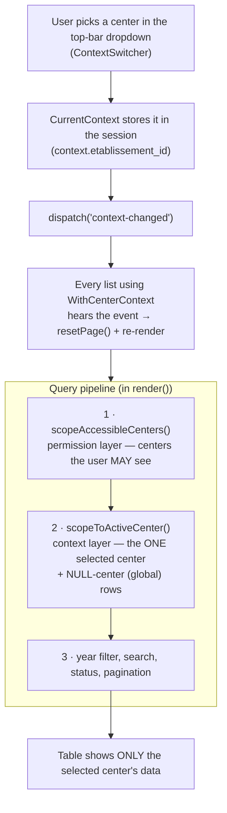

# Center scoping — how data is separated per center

Every backoffice screen follows the **active working context**: the academic
year + center selected in the top-bar switchers. Switching the center in the
dropdown instantly re-filters every CRUD table — no page reload.

## The two layers (don't confuse them)

| Layer | Question it answers | Class |
|---|---|---|
| **Permission scoping** | Which centers MAY this user ever see? | `App\Services\Authorization\CenterAccessService` |
| **Context scoping** | Which ONE center is selected right now? | `App\Services\Context\CurrentContext` + `WithCenterContext` trait |

Both are applied to list queries, in that order. Permission scoping is a
security boundary (never remove it); context scoping is a working filter on
top of it.



## Who can switch

- Users with `centers.access-all` (e.g. super-admin, director): can pick any
  center or **« Tous les centres »** (= no filter, everything shows).
- Everyone else: locked to their employee's `etablissement_id` — the dropdown
  is not clickable and `CurrentContext::etablissementId()` always returns
  their own center.

## The invariant: NULL center = global

A record with `etablissement_id = NULL` belongs to **no** center and is
visible under **every** selected center (same rule as permission scoping —
see `CenterAccessService`). So the filter is:

```php
where(fn ($q) => $q->whereNull('etablissement_id')
                   ->orWhere('etablissement_id', $selectedId))
```

## Screens that are context-scoped

The « Centre » field is **hidden in the add/edit modals** whenever a specific
center is active — the record is assigned to the active center automatically.
The select only appears in « Tous les centres » mode (`$centerLocked` flag).

| Screen | Component | Also scoped in the modal |
|---|---|---|
| Étudiants | `Students\StudentsIndex` | new student auto-assigned to active center (field hidden) |
| Employés | `Employees\EmployeesIndex` | new employee auto-assigned to active center (field hidden) |
| Groupes | `Groups\GroupsIndex` | teacher select; new group is CREATED in the active center/year |
| Inscriptions | `Inscriptions\InscriptionsIndex` | student + group selects |
| Salles (Paramètres) | `Settings\SallesTab` | Centre select ALWAYS visible (admin settings screen), pre-filled with the active center |
| Utilisateurs | `Users\UsersIndex` | filtered via employee's center; accounts without employee (pure admins) always visible |
| Dashboard | `Dashboard\DashboardStats` | KPI counts per selected center/year |

**Deliberately NOT scoped** (global referentials): Établissements,
Années scolaires, Frais catalog, Rôles/Permissions.

## How to make a new list follow the center switcher

```php
use App\Livewire\Backoffice\Concerns\WithCenterContext;

final class ThingsIndex extends Component
{
    use WithCenterContext;   // ① listens to 'context-changed' + resetPage()

    public function render(): View
    {
        $things = Thing::query()
            ->tap(fn ($q) => app(CenterAccessService::class)
                ->scopeAccessibleCenters($q, auth()->user()))   // ② security
            ->tap(fn ($q) => $this->scopeToActiveCenter($q))    // ③ context
            ->paginate(10);
        // ...
    }
}
```

If the table's center column has another name:
`$this->scopeToActiveCenter($q, 'autre_colonne_id')`.
For records scoped indirectly (e.g. via a till or an employee), write the
`whereHas` by hand — see `UsersIndex` for the pattern.

## Tests

`tests/Feature/Backoffice/Context/CenterScopingTest.php` — one test per
scoped list (rows from another center must NOT appear; global NULL-center
rows must appear) plus the live `context-changed` refresh.
`DashboardStatsTest` covers the dashboard side. Keep them green.
